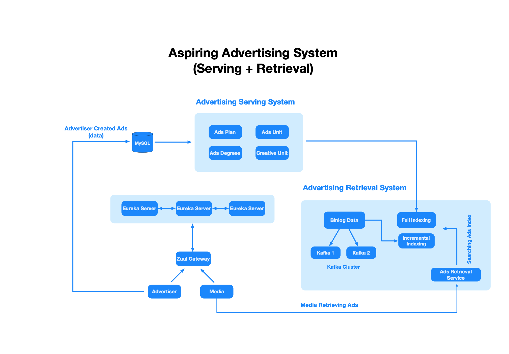
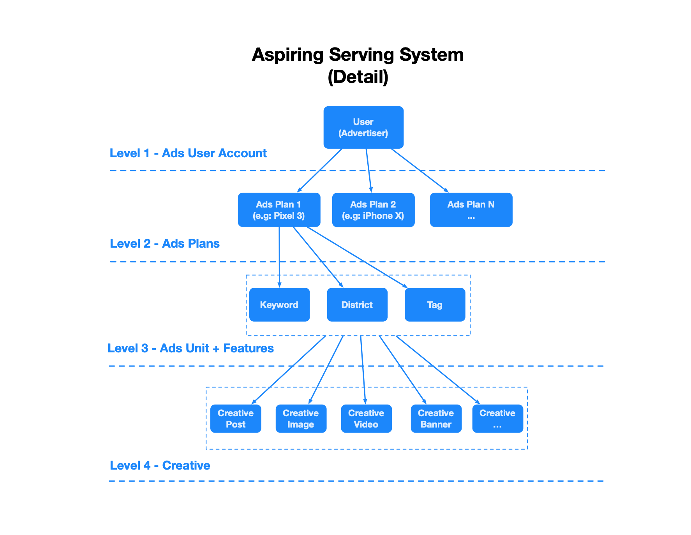
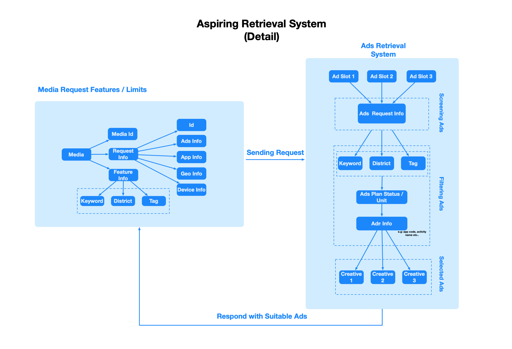
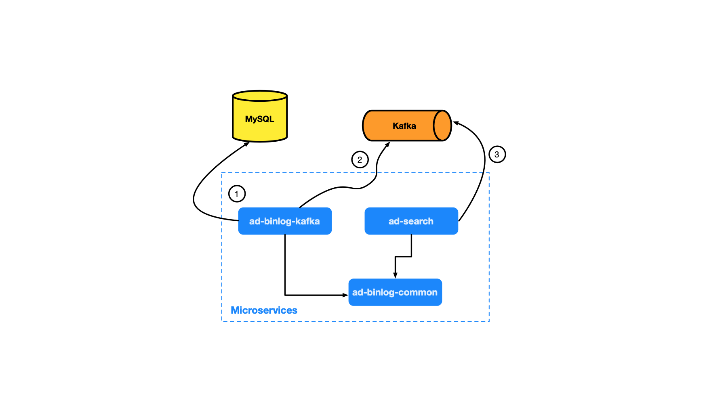

# Adspiring - Advertising System

## Description
- Adspiring is an advertising system that provide functionalities such as serving & retrieving ads, 
ads budgeting, payment & monitoring advertising exposure

## Technology Stack
- Language: Java 
- Framework: Spring Cloud + Spring Boot
- Database: MySQL
- Gateway: Spring Cloud Zuul
- Service Registry: Eureka
- Inter Process Communication: Ribbon + Feign
- Latency & fault tolerance: Hystrix + Hystrix Dashboard
- Distributed streaming platform: Apache Kafka 
 
 
# Advertising System Architecture (Serving & Retrieval part)


# Advertising Serving System (Detail)


# Advertising Retrieval System (Detail)


## Implemented functionalities
- [x] Ads serving system
- [x] Ads retrieval system
- [ ] Ads payment system 
- [ ] Ads reporting system 
- [ ] Ads exposure monitoring system 

# Run Program
1. Launch EurekaApplication
2. Launch ZuulGatewayApplication
3. Launch zookeeper, kafka-server (See [kafka](#kafka) section below)
4. Launch BinlogKafkaApplication
5. Launch SearchApplication
6. Launch DashboardApplication
7. Insert MySQL data
    - In your mysql terminal type command below in your directory. The ```<file-name>.sql``` files is provided in
     project directory: 
        - ```source ./ad-sponsor.sql```         
        - ```source ./adspiring-ad-mock-init-data.sql```         
8. Follow instructions on [Test / Demonstration](#test-/-demonstrate) section below
 
# Microservices
## ad-eureka
- Use as service registry (eureka-server) that allows micro-services (eureka-client) to find & communicate with 
each other. 

## ad-gateway
- Use Zuul as a gateway service to provide dynamic routing, monitoring to other microservices
- Can be used to filter request for logging system
- [Intro to Zuul](https://github.com/Netflix/zuul)

## adspiring-ad-service
- Contains the core logic, controllers, services for developing Adspiring Serving & Retrievavl system

### ad-common
- Contains generic request, response, configuration, vo, exception handler

### ad-binlog-kafka + ad-binlog-common + ad-search
- Tasks Diagram:
    
- Tasks:
    - 1 ```ad-binlog-kafka```
        - Monitoring MySQL Binary Log (binlog) & analyze it
    - 2 ```ad-binlog-kafka```
        - Convert binlog as ```MySQLRowData```, then publishing to Kafka (Act as Kafka producer
     role)
    - 3.```ad-search```
        - Subscribing to Kafka's message, receive ```MySQLRowData``` from ```ad-binlog-kafka```, 
    deserialize and save as ads data index for later use in Ads Retrieval System. 
        - Use of ```hystrix``` in this module as fallback method to handle errors when fetching ads failed. The
         fallback method can perform specific task such as record number of apis' call that are successful / fail
          & logging error for further debugging

### ad-dashboard
- Responsible for monitor Hystrix metrics in real time
  
### ad-dump
- Responsible for dumping full index data to local files (e.g: x.data) when application load

### ad-sponsor
- Responsible for advertiser to post ads in ads serving system, can add, delete, update, get posted ads data      

# Eureka 
- [Intro to Eureka](https://github.com/Netflix/eureka)
- Follow [Setup Eureka Server](https://cloud.spring.io/spring-cloud-netflix/multi/multi_spring-cloud-eureka-server.html) documentation
- Setup peer awareness
- If there are some error while running eureka-server, try ``` mvn clean package -Dmaven.test.skip=true -U```
- For ```git backend```, see [Spring Cloud Config](https://cloud.spring.io/spring-cloud-static/spring-cloud-config/1.2.3.RELEASE/)
- For ```file system backend```, ```cd ad-eureka/target``` run ```java -jar ad-eureka-1.0-SNAPSHOT.jar --spring.profiles.active=<your-peer-servers>```

# Ribbon + Feign
- In ```ad-search/pom.xml``` add ```ribbon``` & ```feign```, use as client-side load balancer & control over behavior
 of HTTP clients involving REST calls with various microservices (eureka clients)
- [Ribbon](https://github.com/Netflix/ribbon): Inter Process Communication (remote procedure calls) library
- [Feign](https://github.com/OpenFeign/feign): Java to HTTP client binder.

# Indexing     
- Full Indexing
    - When retrieval system launched, read all the data and do bulk indexing
    - Dumping data in database table to files
    - Load data using ```AdLevelDataHandler.java``` implemented in ```IndexFileLoader.java```    
- Incremental Indexing
    - When system is running, we need to monitor the changes in database, increment,
    update & build index in realtime.
    - Implementation of ```IndexSender.java```: 
        - Monitoring MySQL Binlog data, construct & update incremental index accordingly
    - Implementation of ```KafkaSender.java```: 
        - Deliver binlog incremental data to other related micro-services, these micro-services
          can listening related topics in Kafka & get the data
        - Can also be used for logging system / data checking                                              
- Cache index is store locally or can be stored in Redis 
       
# MySQL BinLog (Binary Log)
- [Intro to MySQL Binary Log](https://dev.mysql.com/doc/internals/en/binary-log-overview.html)
- [MySQL Binary Log connector](https://github.com/shyiko/mysql-binlog-connector-java)
- Purposes:    
    - Use for copy (replication) from master to slave server. Slave can monitor 
        Binlog and do data replication for consistency.
    - Use for data recovery
    - Can be used for audit & trace of changes about data modification
- Features:
    - Monitor Binlog
    - Analyze Binlog    

# Kafka
- [Intro to Kafka](https://kafka.apache.org/)
- [Download Kafka](https://kafka.apache.org/downloads)
- Read [Quickstart Kafka](https://kafka.apache.org/quickstart)
- Used as distributed streaming services & building real time data pipeline
- Deliver incremental data index to Kafka
- We can use Kafka to reduce MySQL server load, the design is:
    1. ```ad-binlog-kafka``` micoservice will monitoring binlog data & produce message to Kafka
    2. Kafka act as broker that receive published message & sending message to subscriber ```ad-search``` (client)
    3. ```ad-search``` module that subscribe to Kafka can receive the binlog and perform its tasks
        
- Example of Commands (Change your own port number / configuration):
    - Extract your downloaded kafka document
    - ```cd kafka```
    - Launch zookeeper: 
        - ```bin/zookeeper-server-start.sh -daemon config/zookeeper.properties```
    - Launch kafka-server: 
        - ```bin/kafka-server-start.sh config/server.properties```
    - Create kafka-topic:
        - ```shell script
          bin/kafka-topics.sh --create --zookeeper localhost:2181 --replication-factor 1 --partitions 1 
           --topic adspiring_ad_test_0
          ```
    - See kakfa-topic list:
        - ```shell script
          bin/kafka-topics.sh --list --zookeeper localhost:2181
          ```        
    - Launch producer:
        - ```shell script
          bin/kafka-console-producer.sh --broker-list localhost:9092 --topic adspiring_ad_test_0
          ```
    - Launch consumer:
        - ```shell script
          bin/kafka-console-consumer.sh --bootstrap-server localhost:9092 
          --topic adspiring_ad_test_0 --from-beginning
          ```      
    - See kafka-topic info:
        - ```shell script
          bin/kafka-topics.sh --describe --zookeeper localhost:2181 --topic adspiring_ad_test_0
          ```

# Hystrix
- Included in ```ad-search``` module
- [Hystrix](https://github.com/Netflix/Hystrix)
    - A latency & fault tolerance library designed to isolate point of access
        to remote system, micro-services or 3rd party libraries
    - Able to stop cascading failure & enable resilience in distributed system
        
- Use cases:
    - When ```SearchImpl/fetchAds``` method has error, we can use ```@HystrixCommand(fallbackMethod="fallback")```
        to handle the error, or do specific task such as record the number of call that is 
        successful / failed etc..     
        
# Test / Demonstrate 
- Monitoring, publishing & subscribing functions (Binlog -> ad-binlog-kafka (producer) <- kafka -> ad-search (consumer))
    - Commands:
        1. In your mysql, type ```select * from ad_unit;```
        2. Do an update: ```update ad_unit set unit_status=0 where id=10;```
        3. In your ```BinlogKafkaApplication``` (producer) terminal, you can see the commited message to Kafka
            - ```INFO 95077 --- [Thread-23] o.a.kafka.common.utils.AppInfoParser: Kafka version : 1.0.1```
            - ```INFO 95077 --- [Thread-23] o.a.kafka.common.utils.AppInfoParser:  Kafka commitId : c0518aa65f25317e```                    
            - ```INFO 95077 --- [trap-executor-0] c.n.d.s.r.aws.ConfigClusterResolver: Resolving eureka endpoints via configuration```                  
            - ```INFO 95077 --- [trap-executor-0] c.n.d.s.r.aws.ConfigClusterResolver: Resolving eureka endpoints via configuration```  
                                
        4. In your ```SearchApplication``` (consumer) terminal, you can see the subscribed message from Kafka  
           -    ```shell script
                  INFO c.a.ad.consumer.BinlogConsumer 36 - kafka processMysqRowData: {"your_key1": your_value1
                  , "your_key1": your_value1, ...} 
                ```
           -   ```shell script
                  INFO c.a.ad.index.adunit.AdUnitIndex 67 - Before update: {10=AdUnitObject(unitId=10, unitStatus=1,... }          
                ```       
           -    ```shell script
                  INFO c.a.ad.index.adunit.AdUnitIndex 67 - After update: {10=AdUnitObject(unitId=10, unitStatus=0,... }
                ```                